# Desafio 2 — Arquitetura WSL 2 conectada à AWS


> **Guia passo a passo para montar uma estação de desenvolvimento Linux sobre WSL 2, autenticá-la na AWS com credenciais temporárias, operar uma instância EC2 via Session Manager (sem a porta 22 aberta para a internet) e publicar uma imagem Docker no Amazon ECR.**

Este repositório é a resolução do **Desafio 2** da Mentoria *Desafios Fundamentais* da **Formação AWS**, conduzida por **Henrylle Maia**.

Ele foi escrito para ser **seguido**, não apenas lido. As **Etapas 0 a 12** estão na ordem exata de execução, e cada uma responde três perguntas: **onde** o comando roda, **o que** você deve ver na tela e **o que fazer se der erro**. Partindo de um Windows sem nada instalado, seguindo as etapas na ordem, você chega ao mesmo resultado — e desliga tudo no final, sem deixar conta aberta.

Se você nunca mexeu com AWS, comece pela [seção 3](#3-pré-requisitos-custo-e-convenções) e siga em linha reta. Se você só quer entender **por que** cada decisão foi tomada, pule para [Decisões técnicas e o que aprendi](#7-decisões-técnicas-e-o-que-aprendi).

> 🧭 **Prefere executar com um checklist do lado?** O arquivo [`guia-desafio-2.html`](guia-desafio-2.html) traz estas mesmas etapas como roteiro interativo — comando, resposta esperada e caixas de verificação por passo, com o progresso salvo no navegador. Baixe e abra no navegador. Este README continua sendo a fonte autoritativa dos comandos.

---

## Índice

**Parte A — Antes de começar**

- [1. O que você vai construir](#1-o-que-você-vai-construir)
- [2. 🗺 Roadmap da solução](#2--roadmap-da-solução)
- [3. Pré-requisitos, custo e convenções](#3-pré-requisitos-custo-e-convenções)
- [4. Os dois conceitos que sustentam tudo](#4-os-dois-conceitos-que-sustentam-tudo)

**Parte B — O passo a passo**

| Etapa | Onde | O que você faz |
| :-: | :-: | --- |
| [0](#etapa-0--preparar-o-windows-wsl-2-e-docker-desktop) | 🌐 💻 | Preparar o Windows: WSL 2, Ubuntu e Docker Desktop |
| [1](#etapa-1--instalar-a-stack-dentro-do-ubuntu) | 💻 | Instalar AWS CLI, Session Manager Plugin, Node.js e SAM |
| [2](#etapa-2--criar-o-usuário-iam-no-console) | 🌐 | Criar o usuário IAM com as três policies |
| [3](#etapa-3--autenticar-o-terminal-na-aws) | 💻 | Autenticar o terminal com credenciais temporárias |
| [4](#etapa-4--clonar-o-projeto-bia-na-máquina-local) | 💻 | Clonar o projeto BIA na máquina local |
| [5](#etapa-5--criar-o-security-group-bia-dev) | 🌐 | Criar o Security Group `bia-dev` (porta 3001) |
| [6](#etapa-6--criar-a-role-role-acesso-ssm) | 💻 | Criar a role `role-acesso-ssm` e destravar o `AccessDenied` |
| [7](#etapa-7--validar-os-pré-requisitos) | 💻 | Validar VPC, subnet, Security Group e role |
| [8](#etapa-8--lançar-a-ec2-bia-dev-via-script) | 💻 | Lançar a EC2 `bia-dev` por script e capturar ID e IP |
| [9](#etapa-9--entrar-na-máquina-remota-ssm-e-ssh) | 💻 ☁ | Entrar na máquina: SSM (principal) e SSH (alternativo) |
| [10](#etapa-10--rodar-a-aplicação-bia-na-ec2) | ☁ | Subir a aplicação BIA em contêiner e abrir no navegador |
| [11](#etapa-11--build-e-push-da-imagem-para-o-ecr) | 💻 | Build e push da imagem para o Amazon ECR |
| [12](#etapa-12--limpar-tudo-para-não-gerar-custo) | 💻 | Limpar todos os recursos para não gerar custo |

**Parte C — Depois de concluir**

- [5. Checklist de entrega](#5-checklist-de-entrega)
- [6. Problemas encontrados e como resolvi](#6-problemas-encontrados-e-como-resolvi)
- [7. Decisões técnicas e o que aprendi](#7-decisões-técnicas-e-o-que-aprendi)
- [8. Segurança neste repositório](#8-segurança-neste-repositório)
- [9. Créditos e referências](#9-créditos-e-referências)

---

# Parte A — Antes de começar

## 1. O que você vai construir

O laboratório tem dois lados. O **local** é onde você escreve, constrói e se autentica. O **remoto** é onde a carga roda. A fronteira entre os dois é atravessada por **credenciais temporárias** — nunca por chaves fixas.

```text
        LOCAL (sua máquina)                            NUVEM (AWS)
 ┌───────────────────────────────────┐        ┌───────────────────────────────────┐
 │  Windows 11                       │        │  Conta AWS — região us-east-1     │
 │   └── WSL 2 · Ubuntu 24.04 LTS    │        │                                   │
 │        ├── AWS CLI v2             │  auth  │   IAM User + Policies             │
 │        ├── Session Manager Plugin │ ─────► │   (credenciais temporárias, 12h)  │
 │        ├── Node.js                │        │                                   │
 │        ├── SAM CLI                │  ssm   │   EC2 bia-dev                     │
 │        └── Docker (via Desktop)   │ ─────► │    └── Docker · BIA (3001:8080)   │
 │                                   │        │                                   │
 │        docker build / push        │  ecr   │   Amazon ECR                      │
 └───────────────────────────────────┘ ─────► │    └── repositório bia            │
                                              └───────────────────────────────────┘
```

**A mesma jornada, em um olhar — do terminal local até o registry de imagens:**

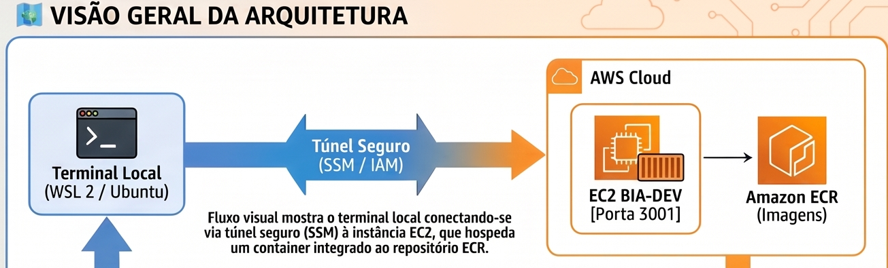

*Recorte do infográfico do desafio, gerado com apoio de IA. O diagrama detalhado da rede — VPC, subnet e Security Group — está em [7.3](#73-a-arquitetura-na-aws).*

Ao final das 12 etapas você terá:

| # | Entrega | Feito na |
| :-: | --- | :-: |
| 1 | Estação WSL 2 com AWS CLI v2, SAM, Node.js e Session Manager Plugin | [Etapas 0 e 1](#etapa-0--preparar-o-windows-wsl-2-e-docker-desktop) |
| 2 | Usuário IAM com policies de SSM, ECR e login local | [Etapa 2](#etapa-2--criar-o-usuário-iam-no-console) |
| 3 | Terminal autenticado com **credenciais temporárias** (`aws login`) | [Etapa 3](#etapa-3--autenticar-o-terminal-na-aws) |
| 4 | Security Group `bia-dev` liberando a porta 3001 | [Etapa 5](#etapa-5--criar-o-security-group-bia-dev) |
| 5 | EC2 `bia-dev` lançada **por script**, com a role `role-acesso-ssm` | [Etapas 6 a 8](#etapa-6--criar-a-role-role-acesso-ssm) |
| 6 | Acesso à EC2 por **SSM** (zero portas abertas) e por **SSH** | [Etapa 9](#etapa-9--entrar-na-máquina-remota-ssm-e-ssh) |
| 7 | Aplicação BIA rodando em contêiner (`3001:8080`) | [Etapa 10](#etapa-10--rodar-a-aplicação-bia-na-ec2) |
| 8 | Imagem Docker publicada no Amazon ECR a partir do WSL | [Etapa 11](#etapa-11--build-e-push-da-imagem-para-o-ecr) |

**A aplicação no ar, servida pelo contêiner na porta 3001:**

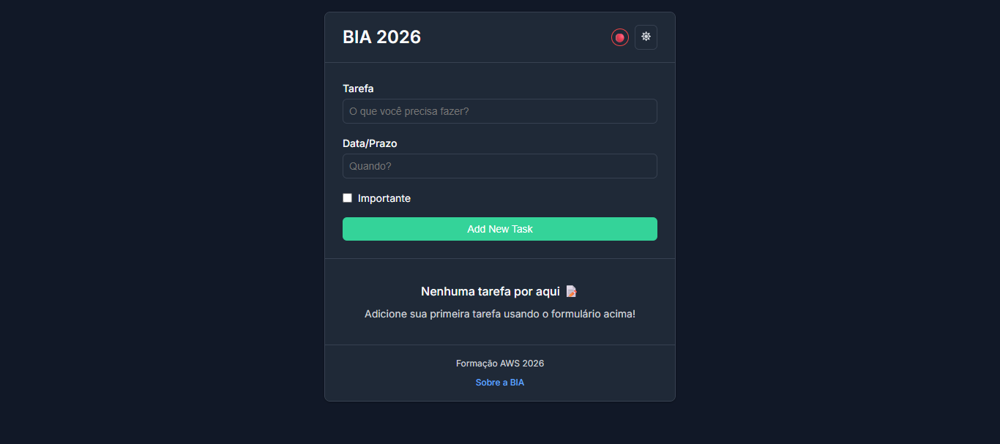

---

## 2. 🗺 Roadmap da solução

O desafio inteiro é um ciclo de três tempos: **construir localmente**, **provar identidade e subir a carga**, **publicar a imagem**. As 13 etapas da Parte B são o detalhamento desses três tempos — e o mapa abaixo mostra a jornada completa de uma vez só.

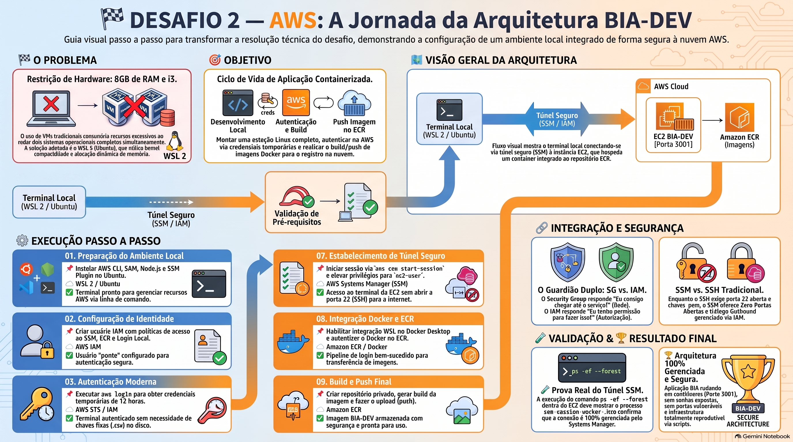

> 🤖 **Sobre este infográfico:** ele foi gerado com apoio de IA e serve como **mapa visual**, não como referência de comandos — alguns nomes de comando aparecem com erros de digitação (`aws log1n`, `nc2-user`). **Os comandos corretos e testados são os das Etapas 0 a 12 deste README**, que é sempre a fonte autoritativa.

| Fase | Etapas | Tempo no ciclo | O que entrega | Termina quando |
| --- | :-: | --- | --- | --- |
| **1. Estação local** | [0](#etapa-0--preparar-o-windows-wsl-2-e-docker-desktop) e [1](#etapa-1--instalar-a-stack-dentro-do-ubuntu) | Desenvolvimento Local | WSL 2 · Ubuntu 24.04 com AWS CLI v2, Session Manager Plugin, Node.js e SAM | `aws --version` responde dentro do Ubuntu |
| **2. Identidade e código** | [2](#etapa-2--criar-o-usuário-iam-no-console) a [4](#etapa-4--clonar-o-projeto-bia-na-máquina-local) | Autenticação e Build | Usuário IAM, credenciais temporárias de 12 h e o projeto BIA clonado | `aws sts get-caller-identity` devolve o seu ARN |
| **3. Infra e execução na nuvem** | [5](#etapa-5--criar-o-security-group-bia-dev) a [10](#etapa-10--rodar-a-aplicação-bia-na-ec2) | Autenticação e Build | Security Group, role `role-acesso-ssm`, EC2 `bia-dev` e a BIA em contêiner | A aplicação responde no IP público, porta 3001 |
| **4. Publicação e encerramento** | [11](#etapa-11--build-e-push-da-imagem-para-o-ecr) e [12](#etapa-12--limpar-tudo-para-não-gerar-custo) | Push Imagem no ECR | Imagem no ECR privado e todos os recursos destruídos | O ECR lista a imagem `bia` e nada mais gera custo |

---

## 3. Pré-requisitos, custo e convenções

### O que você precisa antes de começar

| Requisito | Detalhe |
| --- | --- |
| **Windows 10 (2004+) ou Windows 11** | O WSL 2 é instalado na [Etapa 0](#etapa-0--preparar-o-windows-wsl-2-e-docker-desktop); você não precisa ter nada pronto |
| **Conta AWS ativa** | Com acesso ao Console como root ou administrador, para criar o usuário IAM |
| **Cerca de 8 GB de RAM** | Este laboratório foi executado em um Intel Core i3 de 2 núcleos com 8 GB — o motivo da escolha do WSL 2 está em [7.1](#71-por-que-wsl-2-e-não-uma-vm-tradicional) |
| **Tempo** | Cerca de **1h30** somando todas as etapas, sendo uns 20 min só de instalação na Etapa 0 |

### Sobre o custo

Este laboratório usa **EC2**, **ECR** e **Systems Manager**. O Session Manager não tem custo adicional, mas **a instância EC2 e o armazenamento de imagens no ECR são cobrados** se você ultrapassar o Free Tier ou deixar os recursos ligados.

> ⚠ **Não pule a [Etapa 12](#etapa-12--limpar-tudo-para-não-gerar-custo).** Ela apaga tudo o que foi criado. Uma EC2 esquecida ligada continua sendo cobrada todo mês.

### Como ler as etapas

Cada etapa começa dizendo **onde** o comando é executado. Confira o marcador antes de colar qualquer coisa no terminal — trocar de máquina no meio do caminho é o erro mais comum de quem segue tutoriais de nuvem:

| Marcador | Onde você está | Como o prompt aparece |
| :-: | --- | --- |
| 💻 | **WSL local** — o Ubuntu dentro do seu Windows | `dev@wsl:~$` |
| ☁ | **EC2** — a máquina remota, na AWS | `[ec2-user@ip-172-31-15-143 ~]$` |
| 🌐 | **Console AWS** — o navegador | *(sem terminal)* |

E todos os identificadores nos exemplos são **fictícios**. Substitua pelos seus:

| No guia você vê | O que é, e de onde vem |
| --- | --- |
| `111122223333` | Seu **Account ID** (12 dígitos), obtido na [Etapa 3](#etapa-3--autenticar-o-terminal-na-aws) |
| `i-0abcd1234efgh5681` | O **ID da sua instância** EC2, obtido na [Etapa 8](#etapa-8--lançar-a-ec2-bia-dev-via-script) |
| `203.0.113.10` | O **IP público** da sua EC2, obtido na [Etapa 8](#etapa-8--lançar-a-ec2-bia-dev-via-script) — faixa de documentação, RFC 5737 |
| `formacao_aws` | O nome do **usuário IAM e do profile** — escolha o seu na [Etapa 2](#etapa-2--criar-o-usuário-iam-no-console) e mantenha em todos os comandos |
| `us-east-1` | A **região** usada em todo o laboratório |

> Os prints deste repositório estão **censurados** nas regiões que continham Account ID, ARNs e IDs de recursos. Ver [seção 8](#8-segurança-neste-repositório).

---

## 4. Os dois conceitos que sustentam tudo

Antes do primeiro comando, entenda o conceito que sustenta o desafio inteiro — e que explica **todos** os erros que você pode encontrar pelo caminho. Todo acesso na AWS passa por **duas camadas independentes e sequenciais**:

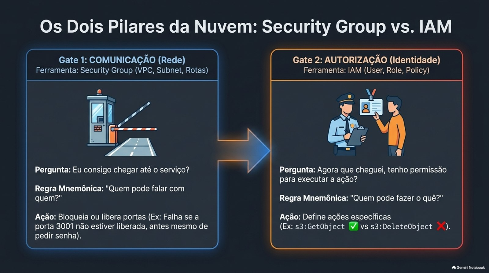

A cancela responde *"quem pode falar com quem?"*; o crachá responde *"quem pode fazer o quê?"*. Em texto, a mesma ideia:

```text
┌──────────────────────────────────────────────────────────────┐
│  1. COMUNICAÇÃO                                              │
│     Eu consigo chegar até o serviço?                         │
│     VPC + Subnet + Rotas + Internet/NAT Gateway + SG         │
└────────────────────────────┬─────────────────────────────────┘
                             ▼
┌──────────────────────────────────────────────────────────────┐
│  2. AUTORIZAÇÃO                                              │
│     Agora que cheguei, posso executar essa ação?             │
│     IAM User + IAM Role + IAM Policy                         │
└────────────────────────────┬─────────────────────────────────┘
                             ▼
                    ┌────────────────┐
                    │ AÇÃO EXECUTADA │
                    └────────────────┘
```

| Recurso | Pergunta que responde | Regra mnemônica | Onde aparece neste guia |
| --- | --- | --- | --- |
| **Security Group** | Eu consigo **me comunicar** com esse recurso? | *Quem pode falar com quem?* | [Etapa 5](#etapa-5--criar-o-security-group-bia-dev) |
| **IAM** | Eu tenho **autorização** para executar essa ação? | *Quem pode fazer o quê?* | [Etapas 2, 3 e 6](#etapa-2--criar-o-usuário-iam-no-console) |

**A ordem importa.** Se o Security Group do destino não permitir a conexão, a comunicação falha **antes** de o IAM sequer ser consultado — não adianta ter a permissão certa. E o inverso também vale: chegar até o serviço não significa poder agir sobre ele.

### Identidade para pessoa × identidade para máquina

```text
   SUA MÁQUINA (pessoa)                RECURSO NA AWS (máquina)

   WSL / Terminal                      EC2
        │                               │  não armazena Access Key
        ▼                               ▼
   AWS CLI                           IAM ROLE
        │  usa credenciais              │
        ▼                               ▼
   IAM USER                          IAM POLICIES
        │                               ├──► permissão para SSM
        ▼                               ├──► permissão para ECR
   AWS API                              └──► permissão para outros serviços
```

Esse é o ponto central: **usuário para gente, role para máquina**. Nunca se cria um "usuário com senha" para um servidor — ele veste uma role. É por isso que a [Etapa 2](#etapa-2--criar-o-usuário-iam-no-console) cria um *user* (para você) e a [Etapa 6](#etapa-6--criar-a-role-role-acesso-ssm) cria uma *role* (para a EC2).

---

# Parte B — O passo a passo

## Etapa 0 — Preparar o Windows (WSL 2 e Docker Desktop)

> **Onde executar:** 🌐 PowerShell do Windows, como administrador · **Tempo:** ~20 min, incluindo um reinício

**Por que esta etapa existe:** todo o resto do desafio acontece dentro de um Linux. O WSL 2 é o que coloca esse Linux dentro do seu Windows, e o Docker Desktop é quem vai construir as imagens.

> 📌 **Complemento didático.** Esta etapa não fazia parte do registro original do desafio — foi acrescentada porque, sem ela, quem parte de um Windows limpo não tem onde executar a Etapa 1.

### 1. Instalar o WSL 2 com Ubuntu

Abra o **PowerShell como administrador** e execute:

```powershell
wsl --install -d Ubuntu-24.04
```

Reinicie o computador quando for pedido. No primeiro boot do Ubuntu ele pede um nome de usuário e uma senha — **esses dados são só do Linux**, não têm nenhuma relação com a AWS.

**O que você deve ver** (de volta no PowerShell):

```powershell
wsl -l -v
```

```text
  NAME            STATE           VERSION
* Ubuntu-24.04    Running         2
```

A coluna `VERSION` precisa ser **2**. Se vier `1`, converta com `wsl --set-version Ubuntu-24.04 2`.

### 2. Instalar o Docker Desktop e ligar a integração com o WSL

Baixe o [Docker Desktop](https://www.docker.com/products/docker-desktop/) e instale. Depois, dentro do aplicativo:

`Settings` → `Resources` → `WSL Integration` → marcar *Enable integration with my default WSL distro* → ativar a chave ao lado do **Ubuntu** → `Apply & restart`.

> 💡 **Dica:** é este passo que faz o comando `docker` existir dentro do Ubuntu. O Docker Desktop mantém **uma única engine** compartilhada entre Windows e Linux — e é justamente por isso que o WSL 2 pesa menos que uma VM tradicional (ver [7.1](#71-por-que-wsl-2-e-não-uma-vm-tradicional)).
>
> ⚠ **Se der erro:** `docker: command not found` dentro do Ubuntu significa que a integração não foi ativada. Ver [6.3](#63-docker-invisível-dentro-do-wsl).

### 3. Ter uma conta AWS ativa

Com acesso ao Console como root ou administrador — é por lá que o usuário IAM será criado na Etapa 2.

**✅ Checkpoint:** abra o Ubuntu pelo menu Iniciar e rode:

```bash
docker --version
```

Se retornar a versão do Docker, o Windows está pronto. **Todas as etapas marcadas com 💻 daqui para frente acontecem dentro desse terminal.**

---

## Etapa 1 — Instalar a stack dentro do Ubuntu

> **Onde executar:** 💻 WSL local · **Tempo:** ~15 min

**Por que esta etapa existe:** o terminal precisa de quatro ferramentas para conversar com a AWS. Sem elas, nenhum comando das etapas seguintes funciona.

| Ferramenta | Para que serve neste desafio |
| --- | --- |
| **AWS CLI v2** | Executar qualquer ação na AWS pelo terminal |
| **Session Manager Plugin** | **Obrigatório** para abrir o terminal interativo do SSM (Etapa 9) |
| **Node.js** | Requisito de alguns comandos do projeto BIA |
| **SAM CLI** | Base para Lambda, CloudFormation e IaC nas etapas seguintes da formação |

### 1. AWS CLI v2 — a porta de entrada para tudo

```bash
sudo apt-get update
sudo apt-get install curl unzip -y

curl "https://awscli.amazonaws.com/awscli-exe-linux-x86_64.zip" -o "awscliv2.zip"
unzip awscliv2.zip
sudo ./aws/install

aws --version
```

### 2. Session Manager Plugin — o componente que a maioria esquece

O AWS CLI sozinho **não** abre a tela interativa do SSM; ele aciona este plugin em segundo plano.

```bash
curl "https://s3.amazonaws.com/session-manager-downloads/plugin/latest/ubuntu_64bit/session-manager-plugin.deb" \
  -o "session-manager-plugin.deb"
sudo dpkg -i session-manager-plugin.deb

aws ssm --version
```

> 💡 **Dica:** se você pular este item, a [Etapa 9](#etapa-9--entrar-na-máquina-remota-ssm-e-ssh) falha com uma mensagem sobre plugin ausente — e o erro não deixa nada óbvio que a causa está aqui atrás.

### 3. Node.js — exigido por alguns comandos do projeto BIA

```bash
cd ~
curl -sL https://deb.nodesource.com/setup_25.x -o nodesource_setup.sh
sudo bash nodesource_setup.sh
sudo apt install nodejs -y

node -v
```

### 4. SAM CLI — aproveitando a integração WSL com o Windows

O WSL 2 enxerga o disco do Windows nativamente. Baixe o `.zip` do SAM pelo navegador do Windows e instale de dentro do Linux, sem baixar de novo:

```text
C:\Users\<seu-usuario>\Downloads\aws-sam-cli-linux-x86_64.zip
                    ↓  (o mesmo arquivo, visto de dentro do Linux)
/mnt/c/Users/<seu-usuario>/Downloads/aws-sam-cli-linux-x86_64.zip
```

```bash
# confirma que o .zip baixado pelo Windows está visível no Linux
ls -lh /mnt/c/Users/<seu-usuario>/Downloads/aws-sam-cli-linux-x86_64.zip

unzip /mnt/c/Users/<seu-usuario>/Downloads/aws-sam-cli-linux-x86_64.zip -d sam-installation
sudo ./sam-installation/install

sam --version
```

**✅ Checkpoint:** os quatro comandos abaixo precisam responder com um número de versão:

```bash
aws --version && aws ssm --version && node -v && sam --version
```

---

## Etapa 2 — Criar o usuário IAM no console

> **Onde executar:** 🌐 Console AWS · **Tempo:** ~5 min

**Por que esta etapa existe:** o seu terminal ainda não é ninguém para a AWS. Antes de qualquer comando, precisa existir uma identidade — e essa identidade precisa carregar as permissões do que vamos fazer.

Toda requisição do CLI responde a duas perguntas, que são as duas camadas da [seção 4](#4-os-dois-conceitos-que-sustentam-tudo):

```text
1. QUEM ESTÁ FAZENDO ESTA REQUISIÇÃO?   →  Autenticação (credenciais)
2. ESSA IDENTIDADE TEM PERMISSÃO?       →  Autorização (IAM Policy)
                                        →  Executar ou negar a ação
```

**Passo a passo no console:**

1. `IAM` → `Users` → `Create user`
2. Nome do usuário: `formacao_aws` — use o nome que quiser, mas **anote**: ele reaparece em quase todos os comandos deste guia
3. Marque **`Provide user access to the AWS Management Console`** — obrigatório para a Etapa 3
4. `Next` → `Attach policies directly`, selecionando as **três**:

| Policy | Para que serve |
| --- | --- |
| `AmazonSSMFullAccess` | Abrir o túnel do Session Manager ([Etapa 9](#etapa-9--entrar-na-máquina-remota-ssm-e-ssh)) |
| `AmazonEC2ContainerRegistryFullAccess` | Falar com o ECR ([Etapa 11](#etapa-11--build-e-push-da-imagem-para-o-ecr)) |
| `SignInLocalDevelopmentAccess` | **Gerar as credenciais temporárias** do `aws login` ([Etapa 3](#etapa-3--autenticar-o-terminal-na-aws)) |

5. `Next` → `Create user`

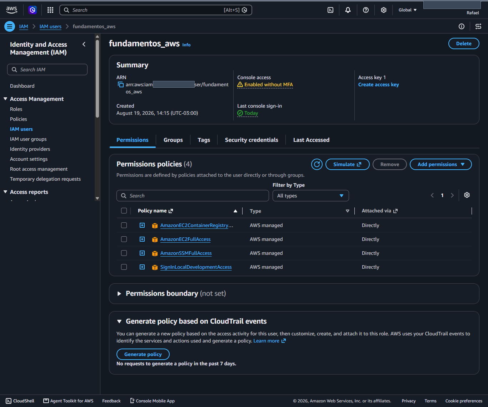

> 💡 **Dica:** a terceira policy é a que quase todo mundo esquece. Sem `SignInLocalDevelopmentAccess`, o `aws login` da próxima etapa simplesmente não autoriza a geração do token temporário.
>
> ⚠ **Ainda falta uma permissão**, mas ela só vai fazer falta na [Etapa 6](#etapa-6--criar-a-role-role-acesso-ssm): a de **criar** roles IAM. Ela é adicionada lá, no momento exato em que o erro aparece — assim você vê a mensagem de erro real antes de aplicar a correção.

**✅ Checkpoint:** o usuário aparece em `IAM` → `Users` com as 3 policies listadas na aba `Permissions`.

---

## Etapa 3 — Autenticar o terminal na AWS

> **Onde executar:** 💻 WSL local · **Tempo:** ~5 min

**Por que esta etapa existe:** é aqui que a máquina local ganha o crachá para agir em nome do usuário IAM criado na etapa anterior.

### 1. Fazer login

```bash
aws login --profile formacao_aws
```

```text
AWS Region [us-east-1]: us-east-1
```

O comando abre o navegador (ou imprime a URL para você abrir manualmente) e, depois da escolha da conta, devolve:

```text
Updated profile formacao_aws to use arn:aws:iam::111122223333:user/formacao_aws credentials.
Use "--profile formacao_aws" to use the new credentials.
```

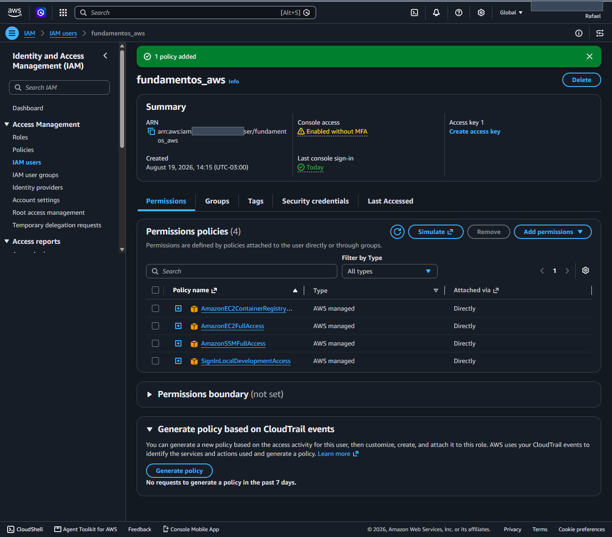

> ⚠ **Se aparecer `gio: Operation not supported`:** é o WSL não conseguindo abrir o navegador do Windows. **Não é fatal** — o próprio comando imprime a URL de autorização; copie e cole no navegador. Ver [6.4](#64-erro-gio-operation-not-supported-no-aws-login).

### 2. Definir o contexto do shell

Este passo evita o erro mais chato do desafio inteiro. Faça agora:

```bash
export AWS_PROFILE=formacao_aws
export AWS_DEFAULT_REGION=us-east-1
```

> 💡 **Leia isto agora, não depois.** Os scripts do projeto BIA (Etapas 6, 7 e 8) chamam `aws ec2 ...` **sem** a flag `--profile`. Sem essas duas variáveis exportadas, eles usam o profile *default* — que está vazio — e reportam que a VPC, a subnet e o Security Group "não existem", mesmo com tudo criado corretamente. Ver [6.1](#61-o-script-não-encontrava-vpc-subnet-nem-security-group).
>
> Para não precisar repetir a cada terminal novo, acrescente as duas linhas ao fim do seu `~/.bashrc`.

### 3. Confirmar quem você é para a AWS

```bash
aws sts get-caller-identity --profile formacao_aws
```

```json
{
    "UserId": "AIDAEXAMPLEUSERID123",
    "Account": "111122223333",
    "Arn": "arn:aws:iam::111122223333:user/formacao_aws"
}
```

> 💡 **Anote o `Account`.** Esses 12 dígitos são o seu Account ID, e você vai precisar deles na [Etapa 11](#etapa-11--build-e-push-da-imagem-para-o-ecr) para montar a URI do ECR.

### 4. Confirmar que a permissão de ECR está de fato funcionando

```bash
aws ecr describe-repositories --region us-east-1
```

Retorno sem erro — mesmo que a lista venha vazia — significa comunicação e autorização confirmadas de ponta a ponta.

### Por que `aws login` e não `aws configure`

Access Keys são credenciais de **longa duração**: quem as obtém acessa a conta indefinidamente. No fim de 2025 a AWS liberou um mecanismo mais seguro, e foi para ele que este laboratório migrou.

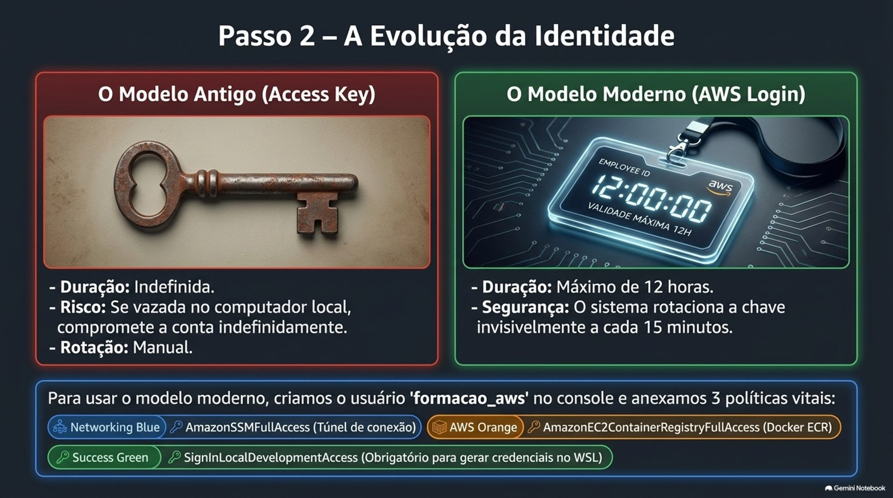

| | Access Keys (`aws configure`) | `aws login` |
| --- | --- | --- |
| Duração | Indefinida, até serem revogadas | **12 horas** |
| Rotação | Manual | **Automática, a cada 15 minutos** |
| Armazenamento local | Chave permanente em disco | Token temporário |
| Risco em caso de vazamento | Alto e persistente | Limitado à janela de validade |

**Se a sua conta ainda não tiver o `aws login` disponível**, o caminho antigo continua funcionando. Crie uma Access Key no console e rode:

```bash
aws configure --profile formacao_aws
```

```text
AWS Access Key ID     [None]: <sua-access-key>
AWS Secret Access Key [None]: <sua-secret-key>
Default region name   [None]: us-east-1
Default output format [None]: table
```

Para encerrar a sessão a qualquer momento:

```bash
aws logout --profile formacao_aws
```

> **Importante distinguir os dois papéis:** `aws login` resolve **quem eu sou** — autentica o seu terminal na conta. O **SSM** ([Etapa 9](#etapa-9--entrar-na-máquina-remota-ssm-e-ssh)) resolve **como eu entro na máquina**. São problemas diferentes, resolvidos por serviços diferentes.

**✅ Checkpoint:** `aws sts get-caller-identity` retorna o seu ARN sem pedir credenciais.

---

## Etapa 4 — Clonar o projeto BIA na máquina local

> **Onde executar:** 💻 WSL local · **Tempo:** ~2 min

**Por que esta etapa existe:** as Etapas 6, 7 e 8 rodam scripts que vivem dentro do repositório do projeto BIA. Sem clonar, não há o que executar.

> 📌 **Complemento didático.** A versão anterior deste README já usava o prompt `dev@wsl:~/bia$` sem nunca mostrar de onde vinha essa pasta. É esta etapa.

```bash
cd ~
git clone https://github.com/henrylle/bia
cd bia

# garante que os scripts são executáveis
chmod +x scripts/*.sh
```

**O que você deve ver:**

```bash
dev@wsl:~/bia$ ls scripts/
criar_role_ssm.sh   lancar_ec2_zona_a.sh   validar_recursos_zona_a.sh   ...
```

| Script | O que ele faz |
| --- | --- |
| `criar_role_ssm.sh` | Cria a role `role-acesso-ssm` e o instance profile que a EC2 vai vestir |
| `validar_recursos_zona_a.sh` | Confere VPC, subnet, Security Group e role **antes** do lançamento |
| `lancar_ec2_zona_a.sh` | Lança a instância `bia-dev` já com o Security Group e a role anexados |

> 💡 **Dica:** a partir daqui, **todo comando marcado 💻 assume que você está dentro de `~/bia`**.

**✅ Checkpoint:** `ls scripts/` lista os três scripts acima.

---

## Etapa 5 — Criar o Security Group bia-dev

> **Onde executar:** 🌐 Console AWS · **Tempo:** ~3 min

**Por que esta etapa existe:** este é o **Gate 1** da [seção 4](#4-os-dois-conceitos-que-sustentam-tudo) — a camada de comunicação. Sem ele, o navegador nunca alcança a aplicação, por mais correta que esteja a permissão IAM.

`EC2` → `Security Groups` → `Create security group`

| Campo | Valor |
| --- | --- |
| Security group name | `bia-dev` |
| Description | acesso do bia-dev |
| Inbound — Type | Custom TCP |
| Inbound — Protocol | TCP |
| Inbound — Port range | **3001** |
| Inbound — Source | Anywhere-IPv4 |

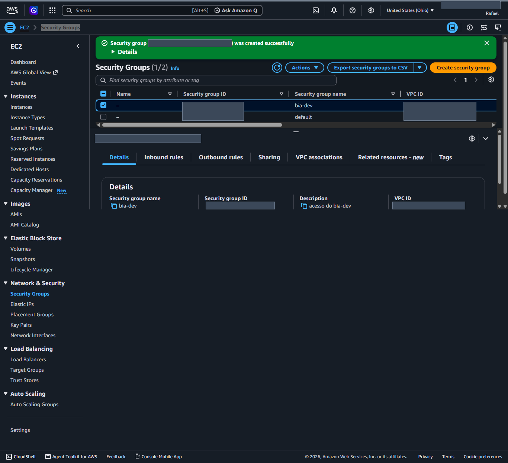

> 💡 **Dica:** a porta **3001** não é arbitrária — é a porta que o contêiner da aplicação BIA publica no host ([Etapa 10](#etapa-10--rodar-a-aplicação-bia-na-ec2)). Se você liberar outra, a aplicação sobe mas não responde, e o navegador fica carregando até dar timeout.
>
> ⚠ **Ressalva:** liberar `Anywhere-IPv4` é aceitável em um laboratório de porta de aplicação. Em produção, essa origem seria restrita a um Load Balancer ou a uma faixa de IPs conhecida.

**✅ Checkpoint:** o SG `bia-dev` aparece na lista com uma regra de entrada `TCP 3001`.

---

## Etapa 6 — Criar a role role-acesso-ssm

> **Onde executar:** 💻 WSL local · **Tempo:** ~10 min, a maior parte resolvendo o `AccessDenied`

**Por que esta etapa existe:** o Security Group resolveu a **comunicação**; a role resolve a **autorização da instância** para conversar com os outros serviços da AWS. Sem ela, a EC2 não fala com o SSM nem com o ECR — e você não consegue entrar na máquina.

Lembre da [seção 4](#4-os-dois-conceitos-que-sustentam-tudo): **usuário para pessoa, role para máquina**. A EC2 não guarda Access Key em disco; ela veste uma role.

```bash
./scripts/criar_role_ssm.sh
```

### ⚠ Na primeira execução, o esperado é falhar assim

```text
An error occurred (AccessDenied) when calling the CreateRole operation:
User: arn:aws:iam::111122223333:user/formacao_aws is not authorized to perform:
iam:CreateRole on resource: arn:aws:iam::111122223333:role/role-acesso-ssm
because no identity-based policy allows the iam:CreateRole action
```

Os mesmos erros se repetem para `CreateInstanceProfile`, `AddRoleToInstanceProfile` e `AttachRolePolicy`.

**Por que acontece:** na [Etapa 2](#etapa-2--criar-o-usuário-iam-no-console) o usuário ganhou permissão de **usar** SSM e ECR, mas nenhuma de **criar identidades IAM**. Permissão de *usar* não é o mesmo que permissão de *criar*. Este é exatamente o item do desafio *"configurar permissões IAM para o usuário ao invés da role"*.

**Como resolver** — anexar uma *inline policy* ao usuário:

`IAM` → `Users` → seu usuário → `Add permissions` → `Create inline policy` → aba `JSON`, e colar:

```json
{
    "Version": "2012-10-17",
    "Statement": [
        {
            "Effect": "Allow",
            "Action": [
                "iam:CreateRole",
                "iam:GetRole",
                "iam:CreateInstanceProfile",
                "iam:GetInstanceProfile",
                "iam:AddRoleToInstanceProfile",
                "iam:AttachRolePolicy",
                "iam:PassRole"
            ],
            "Resource": "*"
        }
    ]
}
```

> ⚠ **Ressalva consciente:** `"Resource": "*"` é aceitável em um laboratório descartável, mas **não em produção**. O correto seria restringir o `Resource` aos ARNs específicos da role e do instance profile, e condicionar o `iam:PassRole` ao serviço `ec2.amazonaws.com`.

Com a policy no lugar, rode o script de novo:

```bash
./scripts/criar_role_ssm.sh
```

**✅ Checkpoint:** a role aparece em `IAM` → `Roles`, ou pelo terminal:

```bash
aws iam get-role --role-name role-acesso-ssm --query "Role.Arn" --output text
```

---

## Etapa 7 — Validar os pré-requisitos

> **Onde executar:** 💻 WSL local · **Tempo:** ~1 min

**Por que esta etapa existe:** conferir as quatro peças — VPC, subnet, Security Group e role — **antes** de lançar a instância. É muito mais barato descobrir um problema agora do que depois de a EC2 subir errada.

```bash
./scripts/validar_recursos_zona_a.sh
```

**O que você deve ver — tudo verde:**

```text
[OK] Tudo certo com a VPC
[OK] Tudo certo com a Subnet
[OK] Security Group bia-dev foi criado
 [OK] Regra de entrada está ok
 [OK] Regra de saída está correta
[OK] Tudo certo com a role 'role-acesso-ssm'
```

### ⚠ Se aparecer isto

```text
[ERRO] Tenho um problema ao retornar a VPC default. Será se ela existe?
[ERRO] Tenho um problema ao retornar a subnet da zona a.
[ERRO] Não achei o security group bia-dev. Ele foi criado?
[ERRO] A role 'role-acesso-ssm' não existe
```

Não entre em pânico e **não recrie nada**: os recursos existem. O script chama `aws ec2 ...` sem `--profile`, então o CLI usa o profile *default*, que está vazio e aponta para lugar nenhum. Volte e execute o `export` da [Etapa 3](#etapa-3--autenticar-o-terminal-na-aws):

```bash
export AWS_PROFILE=formacao_aws
export AWS_DEFAULT_REGION=us-east-1
```

Depois rode o script novamente. Detalhes em [6.1](#61-o-script-não-encontrava-vpc-subnet-nem-security-group).

**✅ Checkpoint:** nenhuma linha `[ERRO]` na saída.

---

## Etapa 8 — Lançar a EC2 bia-dev via script

> **Onde executar:** 💻 WSL local · **Tempo:** ~5 min

**Por que esta etapa existe:** o desafio pede a instância criada **por script, não pelo console**. Esse é o ponto: infraestrutura reproduzível — o mesmo comando gera a mesma máquina, quantas vezes for preciso.

```bash
./scripts/lancar_ec2_zona_a.sh
```

O script já anexa o Security Group `bia-dev` (Etapa 5) e a role `role-acesso-ssm` (Etapa 6).

### Capture os dois dados que você vai usar adiante

O **ID da instância** (para o SSM, na Etapa 9) e o **IP público** (para abrir a aplicação no navegador, na Etapa 10):

```bash
aws ec2 describe-instances \
  --filters "Name=tag:Name,Values=bia-dev" "Name=instance-state-name,Values=running" \
  --query "Reservations[].Instances[].{ID:InstanceId,IP:PublicIpAddress,Lancamento:LaunchTime}" \
  --output table \
  --profile formacao_aws
```

```text
--------------------------------------------------------------------
|                        DescribeInstances                         |
+----------------------+---------------+---------------------------+
|          ID          |      IP       |        Lancamento         |
+----------------------+---------------+---------------------------+
|  i-0abcd1234efgh5681 |  203.0.113.10 | 2026-08-25T15:32:24+00:00 |
+----------------------+---------------+---------------------------+
```

Se quiser ver todas as instâncias em execução na conta, e não só a `bia-dev`:

```bash
aws ec2 describe-instances \
  --filters "Name=instance-state-name,Values=running" \
  --query "Reservations[*].Instances[*].{ID:InstanceId,Name:Tags[?Key=='Name']|[0].Value,Lancamento:LaunchTime}" \
  --output table \
  --profile formacao_aws
```

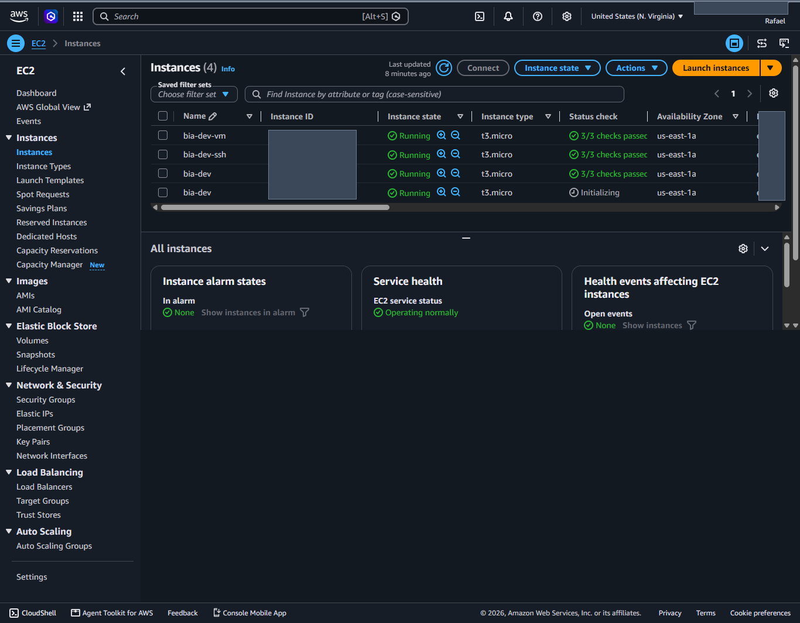

> 💡 **Dica:** guarde os dois valores em algum lugar. Onde este guia escrever `i-0abcd1234efgh5681`, use o **seu** ID; onde escrever `203.0.113.10`, use o **seu** IP.
>
> ⚠ **A instância aparece sem IP público?** Aguarde alguns segundos e rode o comando de novo — o IP é atribuído durante a inicialização da máquina.

**✅ Checkpoint:** o comando retorna uma linha com um ID e um IP.

---

## Etapa 9 — Entrar na máquina remota (SSM e SSH)

> **Onde executar:** 💻 WSL local → ☁ EC2 · **Tempo:** ~10 min

**Por que esta etapa existe:** o desafio pede **os dois caminhos**. Faça os dois justamente para entender por que um deles é melhor. O **9A (SSM) é o caminho principal**; o 9B existe para comparação.

```text
                                   +-------+
                      +----------->|  IAM  |  (autenticação / permissão)
                      |            +-------+
                      |
+-------------+       |          (OUTBOUND — o agente inicia)
| USER (SSM)  |◄──────┼─────────────────────────────+
+-------------+       |    [ SSM SESSION ]          |
                      +-----------------------------|
                                              +-----+-----------+
                                              | EC2             |
+-------------+   (INBOUND — porta 22)        |   AGENT SSM     |
| USER (SSH)  |─────────────────────────────► |                 |
|  chave .pem |      [ CONEXÃO SSH ]          |                 |
+-------------+                               +-----------------+
```

### 9A — SSM (Session Manager), o caminho recomendado

**Requisitos, dos dois lados.** Se qualquer uma das cinco pontas faltar, o terminal responde com timeout ou com "instância não está online":

| Lado | Requisito | Resolvido na |
| --- | --- | :-: |
| Máquina local | AWS CLI configurado, com permissão para `ssm:StartSession` | Etapas 1 e 2 |
| Máquina local | **Session Manager Plugin** instalado | Etapa 1 |
| EC2 | `amazon-ssm-agent` rodando (já vem ativo no Amazon Linux 2023) | — |
| EC2 | Role IAM anexada, com `AmazonSSMManagedInstanceCore` | Etapas 6 e 8 |
| EC2 | Saída para a internet (subnet pública / NAT) ou VPC Endpoints | Etapa 8 |

**Conectando** — troque pelo ID da sua instância:

```bash
aws ssm start-session --target i-0abcd1234efgh5681 --profile formacao_aws
```

```text
Starting session with SessionId: formacao_aws-xxxxxxxxxxxxxxxxxxxxxxxxx

sh-5.2$
```

**Agora troque para o usuário de trabalho:**

```bash
sudo su - ec2-user
```

```text
[ec2-user@ip-172-31-15-143 ~]$
```

> 💡 **Por que `sudo su - ec2-user` e não trabalhar onde você caiu:**
>
> - `/usr/bin` é reservado aos executáveis do sistema operacional e ao gerenciador de pacotes. Misturar código de aplicação ali gera **conflito** — uma atualização do SO pode sobrescrever arquivos.
> - Escrever nessas pastas exige **root**, e rodar aplicação como root é uma falha grave de segurança.
> - `ec2-user` é o usuário padrão do Amazon Linux. Em `/home/ec2-user` você tem controle total para clonar repositórios e instalar bibliotecas **sem risco de quebrar o servidor**.

**A prova de que a sessão é SSM** — a árvore de processos:

```bash
ps -ef --forest | grep ssm
```

```text
root        1427       1  /usr/bin/amazon-ssm-agent
root        1528    1427   \_ /usr/bin/ssm-agent-worker
root        3792    1528       \_ /usr/bin/ssm-session-worker formacao_aws-xxxxxxxx
ssm-user    3805    3792           \_ sh
```

A presença de **`/usr/bin/ssm-session-worker`** é a prova categórica: a conexão foi estabelecida pelo Systems Manager, **sem a porta 22 aberta para a internet**.

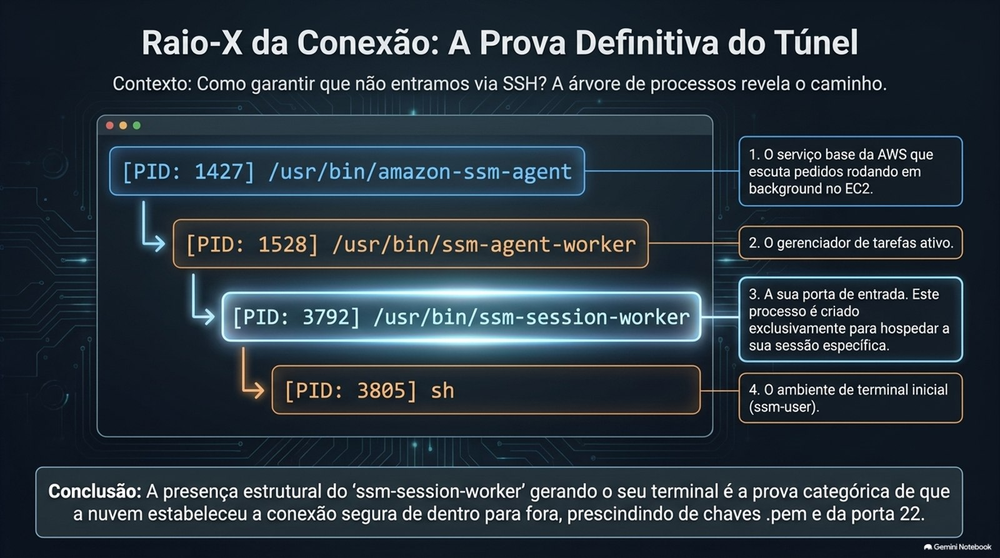

```text
amazon-ssm-agent  (PID 1427) ─ serviço base, escuta pedidos de conexão da AWS
   └── ssm-agent-worker (PID 1528) ─ gerencia tarefas e processos da máquina
        └── ssm-session-worker (PID 3792) ─ criado exclusivamente para a SUA sessão
             └── sh (PID 3805) ─ shell inicial, sob o usuário 'ssm-user'
                  └── su - ec2-user ─ ambiente de trabalho seguro
```

> ⚠ **Para sair**, `exit` precisa ser executado mais de uma vez, porque há camadas empilhadas: `ec2-user` → `ssm-user` → terminal local. Ver [6.5](#65-sair-do-ssm-exige-mais-de-um-exit).

### 9B — SSH tradicional, o caminho alternativo

Aqui a lógica se inverte: em vez de a máquina chamar a AWS, **é você que bate na porta dela** — e por isso é preciso **abrir uma regra de entrada**.

> ⚠ **Leia antes de começar:** a instância lançada na [Etapa 8](#etapa-8--lançar-a-ec2-bia-dev-via-script) **não serve para este caminho**. O `lancar_ec2_zona_a.sh` não anexa key pair nenhum, e uma chave SSH **só pode ser associada no momento em que a instância nasce** — não dá para acrescentar depois. Então este caminho usa uma **segunda instância**, criada só para a demonstração, que foi o que fiz no laboratório original (`bia-dev-ssh`).
>
> Se o seu objetivo é só cumprir o desafio pelo caminho recomendado, pule para a [Etapa 10](#etapa-10--rodar-a-aplicação-bia-na-ec2) — o 9A já entrega o acesso à máquina.

**1. Criar o par de chaves** — antes de lançar a instância, não depois.

> 📌 **Complemento didático.** A versão anterior deste README conectava por SSH usando um `formacao.pem` que nunca era criado em nenhuma etapa.

```bash
aws ec2 create-key-pair \
  --key-name formacao \
  --query "KeyMaterial" \
  --output text \
  --profile formacao_aws > ~/formacao.pem
```

**2. Restringir a permissão da chave.** O SSH é rigoroso: se o `.pem` puder ser lido por qualquer usuário do sistema, a conexão é **recusada**.

```bash
chmod 400 ~/formacao.pem

# se você não lembra onde salvou a chave:
find / -name "formacao.pem" 2>/dev/null
```

> ⚠ **Nunca versione um `.pem`.** O `.gitignore` deste repositório já bloqueia `*.pem`, `*.ppk` e `*.csv`.

**3. Security Group dedicado:** `EC2` → `Security Groups` → `Create security group`

| Campo | Valor |
| --- | --- |
| Security group name | `bia-dev-ssh` |
| Description | acesso por ssh |
| Inbound — Type | SSH |
| Inbound — Source | **My IP** |

> 💡 **Por que `My IP` e não `Anywhere-IPv4`?** A porta 22 é o alvo mais varrido da internet. Restringir à origem conhecida é o mínimo — e mesmo assim continua sendo uma porta aberta, que é exatamente o que o SSM elimina.

**4. Lançar a segunda instância**, pelo console (`EC2` → `Launch instance`), com **três** requisitos: Amazon Linux 2023, o **key pair `formacao`** criado no passo 1, o Security Group **`bia-dev-ssh`** do passo 3 e **IPv4 público habilitado**. Sem o IP público não há como alcançar a máquina de fora.

Depois capture o IP público dela, do mesmo jeito da Etapa 8:

```bash
aws ec2 describe-instances \
  --filters "Name=tag:Name,Values=bia-dev-ssh" "Name=instance-state-name,Values=running" \
  --query "Reservations[].Instances[].PublicIpAddress" \
  --output text \
  --profile formacao_aws
```

**5. Conectar:**

```bash
ssh -i ~/formacao.pem ec2-user@203.0.113.10
```

```text
   ,     #_
   ~\_  ####_        Amazon Linux 2023
  ~~  \_#####\
  ~~     \###|
  ~~       \#/ ___   https://aws.amazon.com/linux/amazon-linux-2023
   ~~       V~' '->
    ~~~         /
      ~~._.   _/
         _/ _/
       _/m/'

[ec2-user@ip-172-31-4-102 ~]$ pwd
/home/ec2-user
```

**A prova de que a sessão é SSH:**

```bash
echo $SSH_CLIENT
```

```text
203.0.113.45 53650 22        # IP de origem, porta local, porta de destino 22
```

A porta **22** no `$SSH_CLIENT` é o carimbo: essa sessão entrou pelo SSH, não pelo SSM.

> 💡 A comparação completa entre os dois caminhos, e a razão de o SSM ser preferível, está em [7.2](#72-ssm--ssh-o-comparativo-completo).

**✅ Checkpoint:** você viu o prompt `[ec2-user@ip-...]$` pelo menos pelo caminho 9A, e `ps -ef --forest | grep ssm` mostra o `ssm-session-worker`.

---

## Etapa 10 — Rodar a aplicação BIA na EC2

> **Onde executar:** ☁ EC2, dentro da sessão aberta na Etapa 9 · **Tempo:** ~5 min

**Por que esta etapa existe:** é a carga de trabalho — o que justifica toda a infraestrutura montada até aqui.

```bash
git clone https://github.com/henrylle/bia
cd bia
docker compose up -d
docker compose ps
```

> 💡 **Atenção:** este `git clone` é **dentro da EC2**, e é diferente do da [Etapa 4](#etapa-4--clonar-o-projeto-bia-na-máquina-local), que foi na sua máquina local. São duas cópias do mesmo projeto em lugares diferentes: a local serve para rodar os scripts e fazer o build; a remota serve para rodar a aplicação.

**O que você deve ver — três contêineres no ar:**

| NAME | IMAGE | STATUS | PORTS |
| --- | --- | --- | --- |
| `bia` | `bia-server` | Up | `0.0.0.0:3001->8080/tcp` |
| `database` | `postgres:17.1` | Up | `0.0.0.0:5433->5432/tcp` |
| `redis` | `valkey/valkey:8.1-alpine` | Up | `0.0.0.0:6379->6379/tcp` |

A porta **3001** liberada no Security Group da [Etapa 5](#etapa-5--criar-o-security-group-bia-dev) é exatamente a que o contêiner `bia` publica.

**Agora abra no navegador do Windows**, usando o IP público capturado na [Etapa 8](#etapa-8--lançar-a-ec2-bia-dev-via-script):

```text
http://203.0.113.10:3001
```


> ⚠ **A página não abre?** Cheque nesta ordem:
>
> 1. O contêiner `bia` está `Up` com `0.0.0.0:3001->8080/tcp` no `docker compose ps`.
> 2. O Security Group `bia-dev` da [Etapa 5](#etapa-5--criar-o-security-group-bia-dev) libera TCP 3001.
> 3. O IP usado é o **público**, e não o `172.31.x.x` que aparece no prompt da EC2.
>
> Se for o item 2, o navegador fica carregando até dar timeout — é o Gate 1 barrando a conexão antes de o IAM sequer ser consultado.

**✅ Checkpoint:** a interface da BIA carrega no navegador na porta 3001.

---

## Etapa 11 — Build e push da imagem para o ECR

> **Onde executar:** 💻 WSL local · **Tempo:** ~10 min

**Por que esta etapa existe:** esta é a entrega do Dia 2 — construir a imagem **na sua máquina local** e publicá-la no registry privado da AWS. Note que aqui saímos da EC2 e voltamos ao WSL.

> 💡 Se você ainda está dentro da EC2, digite `exit` até voltar ao prompt `dev@wsl:~$` — lembrando que são [mais de um `exit`](#65-sair-do-ssm-exige-mais-de-um-exit).

### 1. Criar o repositório no ECR

```bash
aws ecr create-repository --repository-name bia --region us-east-1 --profile formacao_aws
```

Ou pelo console: `ECR` → `Create repository` → nome `bia`.

### 2. Autenticar o Docker local no ECR

Troque `111122223333` pelo seu Account ID — o mesmo que apareceu no `aws sts get-caller-identity` da [Etapa 3](#etapa-3--autenticar-o-terminal-na-aws):

```bash
aws ecr get-login-password --region us-east-1 --profile formacao_aws \
  | docker login --username AWS --password-stdin 111122223333.dkr.ecr.us-east-1.amazonaws.com
```

```text
Login Succeeded
```

> ⚠ **Erro de `docker: command not found` ou de daemon?** A integração do Docker Desktop com o WSL não está ligada. Volte à [Etapa 0](#etapa-0--preparar-o-windows-wsl-2-e-docker-desktop) ou veja [6.3](#63-docker-invisível-dentro-do-wsl).

### 3. Build, tag e push

A partir de `~/bia`:

```bash
cd ~/bia
docker build -t bia .
docker tag bia:latest 111122223333.dkr.ecr.us-east-1.amazonaws.com/bia:latest
docker push 111122223333.dkr.ecr.us-east-1.amazonaws.com/bia:latest
```

> 💡 **Alternativa:** o projeto BIA traz um script pronto para isso — basta copiá-lo e apontar para o seu registry:
>
> ```bash
> cp scripts/ecs/unix/build.sh .
> nano build.sh    # trocar ECR_REGISTRY="SEU_REGISTRY" pela URI do seu ECR
> chmod +x build.sh
> ./build.sh
> ```

### 4. Conferir o resultado

```bash
aws ecr describe-repositories --region us-east-1
```

```json
{
    "repositories": [
        {
            "repositoryArn": "arn:aws:ecr:us-east-1:111122223333:repository/bia",
            "registryId": "111122223333",
            "repositoryName": "bia",
            "repositoryUri": "111122223333.dkr.ecr.us-east-1.amazonaws.com/bia",
            "imageTagMutability": "MUTABLE",
            "imageScanningConfiguration": { "scanOnPush": false },
            "encryptionConfiguration": { "encryptionType": "AES256" }
        }
    ]
}
```

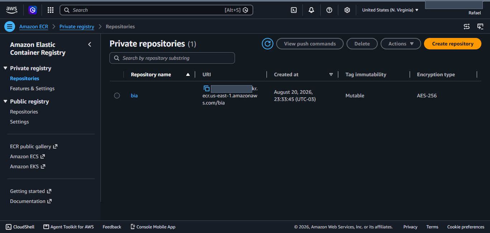

**✅ Checkpoint:** a imagem aparece listada no repositório:

```bash
aws ecr list-images --repository-name bia --region us-east-1 --profile formacao_aws
```

---

## Etapa 12 — Limpar tudo para não gerar custo

> **Onde executar:** 💻 WSL local · **Tempo:** ~5 min

**Por que esta etapa existe:** uma EC2 esquecida ligada continua sendo cobrada. Esta é a etapa que quase nenhum tutorial documenta e que todo mundo deveria executar.

> 📌 **Complemento didático.** Não fazia parte do registro original do desafio. Execute **depois** de tirar seus prints e validar as entregas do [checklist](#5-checklist-de-entrega).

A ordem importa: recursos em uso não podem ser apagados.

### 1. Terminar a instância

Comece listando **tudo** o que ainda está de pé, para não esquecer nenhuma máquina — inclusive a segunda instância, se você tiver feito a Etapa 9B:

```bash
aws ec2 describe-instances \
  --filters "Name=instance-state-name,Values=running" \
  --query "Reservations[].Instances[].{ID:InstanceId,Name:Tags[?Key=='Name']|[0].Value}" \
  --output table \
  --profile formacao_aws
```

Depois termine cada uma delas:

```bash
# use os SEUS IDs; separe por espaço se houver mais de uma
INSTANCE_IDS="i-0abcd1234efgh5681 i-0abcd1234efgh5679"

aws ec2 terminate-instances --instance-ids $INSTANCE_IDS --profile formacao_aws

# aguarda até estarem de fato terminadas (pode levar cerca de 1 minuto)
aws ec2 wait instance-terminated --instance-ids $INSTANCE_IDS --profile formacao_aws
```

### 2. Apagar os Security Groups

Só funciona depois que nenhuma instância os utiliza — por isso o `wait` do passo anterior.

```bash
aws ec2 delete-security-group --group-name bia-dev --profile formacao_aws

# só se você tiver feito a Etapa 9B
aws ec2 delete-security-group --group-name bia-dev-ssh --profile formacao_aws
```

### 3. Apagar o repositório do ECR

O `--force` remove também as imagens que estão dentro dele.

```bash
aws ecr delete-repository --repository-name bia --force --region us-east-1 --profile formacao_aws
```

### 4. Desfazer a role e o instance profile

```bash
aws iam remove-role-from-instance-profile \
  --instance-profile-name role-acesso-ssm \
  --role-name role-acesso-ssm \
  --profile formacao_aws

aws iam delete-instance-profile --instance-profile-name role-acesso-ssm --profile formacao_aws

aws iam detach-role-policy \
  --role-name role-acesso-ssm \
  --policy-arn arn:aws:iam::aws:policy/AmazonSSMManagedInstanceCore \
  --profile formacao_aws

aws iam delete-role --role-name role-acesso-ssm --profile formacao_aws
```

> 💡 **Dica:** se o `delete-role` reclamar de policies ainda anexadas, liste-as e destaque uma a uma antes de repetir:
>
> ```bash
> aws iam list-attached-role-policies --role-name role-acesso-ssm --profile formacao_aws
> ```

### 5. Apagar o par de chaves

Só se você tiver feito a Etapa 9B:

```bash
aws ec2 delete-key-pair --key-name formacao --profile formacao_aws
rm -f ~/formacao.pem
```

### 6. Encerrar a sessão

```bash
aws logout --profile formacao_aws
```

**✅ Checkpoint:** o comando abaixo não retorna nenhuma instância:

```bash
aws ec2 describe-instances \
  --filters "Name=tag:Name,Values=bia-dev" "Name=instance-state-name,Values=running" \
  --query "Reservations[].Instances[].InstanceId" \
  --output text \
  --profile formacao_aws
```

E confira o `Billing` → `Cost Explorer` no console nos dias seguintes, para confirmar que nada ficou rodando.

---

# Parte C — Depois de concluir

## 5. Checklist de entrega

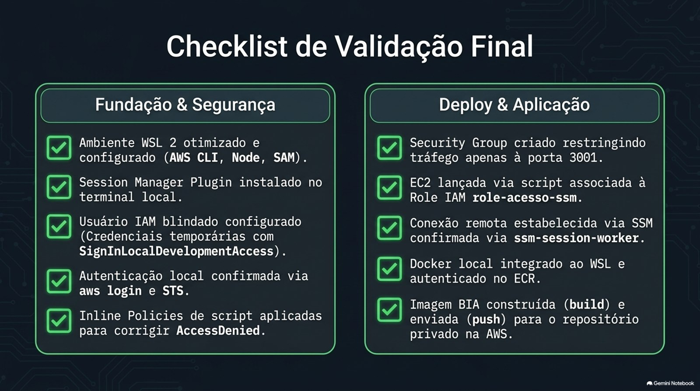

**Parte 1 — Fundação**

- [x] AWS CLI v2 instalado e funcional no WSL — [Etapa 1](#etapa-1--instalar-a-stack-dentro-do-ubuntu)
- [x] SAM CLI instalado — [Etapa 1](#etapa-1--instalar-a-stack-dentro-do-ubuntu)
- [x] Node.js instalado — [Etapa 1](#etapa-1--instalar-a-stack-dentro-do-ubuntu)
- [x] Session Manager Plugin instalado (`aws ssm --version`) — [Etapa 1](#etapa-1--instalar-a-stack-dentro-do-ubuntu)
- [x] Usuário IAM criado com policies de SSM e ECR — [Etapa 2](#etapa-2--criar-o-usuário-iam-no-console)
- [x] Credenciais configuradas no terminal — [Etapa 3](#etapa-3--autenticar-o-terminal-na-aws)
- [x] Migração para credenciais temporárias (`aws login` + `SignInLocalDevelopmentAccess`) — [Etapa 3](#etapa-3--autenticar-o-terminal-na-aws)
- [x] Máquina de trabalho `bia-dev` lançada — [Etapa 8](#etapa-8--lançar-a-ec2-bia-dev-via-script)
- [x] Conexão do WSL para a `bia-dev` **por SSM**, comprovada via `ssm-session-worker` — [Etapa 9A](#etapa-9--entrar-na-máquina-remota-ssm-e-ssh)
- [x] Conexão do WSL para a `bia-dev` **por SSH**, comprovada via `$SSH_CLIENT` na porta 22 — [Etapa 9B](#etapa-9--entrar-na-máquina-remota-ssm-e-ssh)

**Parte 2 — Dia 1**

- [x] Security Group `bia-dev` criado (TCP 3001) — [Etapa 5](#etapa-5--criar-o-security-group-bia-dev)
- [x] Role `role-acesso-ssm` criada por script — [Etapa 6](#etapa-6--criar-a-role-role-acesso-ssm)
- [x] EC2 `bia-dev` lançada **via script** (`lancar_ec2_zona_a.sh`) — [Etapa 8](#etapa-8--lançar-a-ec2-bia-dev-via-script)
- [x] Permissões IAM configuradas **no usuário**, e não apenas na role — [Etapa 6](#etapa-6--criar-a-role-role-acesso-ssm)
- [x] Comunicação com o ECR testada (`aws ecr describe-repositories`) — [Etapa 3](#etapa-3--autenticar-o-terminal-na-aws)
- [x] Aplicação BIA rodando em contêiner na porta 3001 — [Etapa 10](#etapa-10--rodar-a-aplicação-bia-na-ec2)

**Parte 2 — Dia 2**

- [x] Docker habilitado no WSL via *WSL Integration* — [Etapa 0](#etapa-0--preparar-o-windows-wsl-2-e-docker-desktop)
- [x] Docker autenticado no ECR (`Login Succeeded`) — [Etapa 11](#etapa-11--build-e-push-da-imagem-para-o-ecr)
- [x] Repositório `bia` criado no ECR — [Etapa 11](#etapa-11--build-e-push-da-imagem-para-o-ecr)
- [x] `docker build` executado a partir do WSL — [Etapa 11](#etapa-11--build-e-push-da-imagem-para-o-ecr)
- [x] `docker push` da imagem para o ECR concluído — [Etapa 11](#etapa-11--build-e-push-da-imagem-para-o-ecr)

---

## 6. Problemas encontrados e como resolvi

Esta seção é, para mim, a mais valiosa do repositório: nenhum desses erros aparece nos tutoriais. Cada um também está sinalizado, em linha, na etapa onde ele acontece.

### 6.1. O script não encontrava VPC, subnet nem Security Group

*Acontece na [Etapa 7](#etapa-7--validar-os-pré-requisitos).*

```text
dev@wsl:~/bia$ ./scripts/validar_recursos_zona_a.sh
[ERRO] Tenho um problema ao retornar a VPC default. Será se ela existe?
[ERRO] Tenho um problema ao retornar a subnet da zona a.
[ERRO] Não achei o security group bia-dev. Ele foi criado?
[ERRO] A role 'role-acesso-ssm' não existe
```

**Diagnóstico:** os recursos existiam. O script chamava `aws ec2 ...` **sem `--profile`**, então o CLI usava o profile *default* — que estava vazio, apontando para lugar nenhum.

**Solução:** promover o profile autenticado a padrão da sessão do shell, antes de rodar qualquer script:

```bash
export AWS_PROFILE=formacao_aws
export AWS_DEFAULT_REGION=us-east-1
```

**Aprendizado:** o AWS CLI não tem "contexto implícito". Quando um script não passa `--profile`, quem define o contexto é a variável de ambiente.

### 6.2. AccessDenied ao criar a role pelo script

*Acontece na [Etapa 6](#etapa-6--criar-a-role-role-acesso-ssm).*

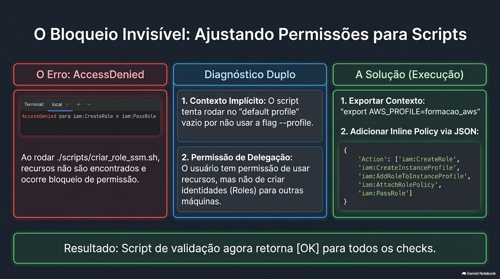

```text
dev@wsl:~/bia$ ./scripts/criar_role_ssm.sh
An error occurred (AccessDenied) when calling the CreateRole operation:
User: arn:aws:iam::111122223333:user/formacao_aws is not authorized to perform:
iam:CreateRole on resource: arn:aws:iam::111122223333:role/role-acesso-ssm
because no identity-based policy allows the iam:CreateRole action
```

Os mesmos erros se repetiram para `CreateInstanceProfile`, `AddRoleToInstanceProfile` e `AttachRolePolicy`.

**Diagnóstico:** o usuário tinha permissão de **usar** SSM e ECR, mas nenhuma de **criar identidades IAM**. Este é exatamente o item do desafio *"configurar permissões IAM para o usuário ao invés da role"*.

**Solução:** anexar ao usuário uma *inline policy* com as sete ações IAM listadas na [Etapa 6](#etapa-6--criar-a-role-role-acesso-ssm).

### 6.3. Docker invisível dentro do WSL

*Acontece nas [Etapas 0](#etapa-0--preparar-o-windows-wsl-2-e-docker-desktop) e [11](#etapa-11--build-e-push-da-imagem-para-o-ecr).*

O `docker build` falhava porque o Docker Desktop não estava exposto para a distro Linux.

**Solução:** Docker Desktop → `Settings` → `Resources` → `WSL Integration` → marcar *Enable integration with my default WSL distro*, ativar a chave ao lado do Ubuntu → `Apply & restart`.

### 6.4. Erro "gio: Operation not supported" no aws login

*Acontece na [Etapa 3](#etapa-3--autenticar-o-terminal-na-aws).*

O `aws login` tenta abrir o navegador do host e, no WSL, isso pode falhar:

```text
gio: https://us-east-1.signin.aws.amazon.com/v1/authorize?... : Operation not supported
```

**Não é um erro fatal.** O próprio comando imprime a URL de autorização — basta copiá-la e abrir no navegador do Windows. O fluxo continua normalmente e o profile é atualizado ao final.

### 6.5. Sair do SSM exige mais de um exit

*Acontece nas [Etapas 9A](#etapa-9--entrar-na-máquina-remota-ssm-e-ssh) e [11](#etapa-11--build-e-push-da-imagem-para-o-ecr).*

Ao digitar `exit` a primeira vez, o prompt vira `sh-5.2$` em vez de voltar ao WSL:

```text
[ec2-user@ip-172-31-15-143 ~]$ exit
logout
sh-5.2$
```

**Por quê:** existem camadas empilhadas. O primeiro `exit` encerra o `ec2-user` e devolve ao `ssm-user` (o usuário do agente). O segundo encerra o túnel do Systems Manager e devolve o controle ao terminal local.

---

## 7. Decisões técnicas e o que aprendi

Esta parte não é necessária para executar o guia — é o registro do **porquê** de cada escolha.

### 7.1. Por que WSL 2 e não uma VM tradicional

Essa foi a **primeira decisão técnica do desafio**, e ela nasceu de uma restrição real de recurso.

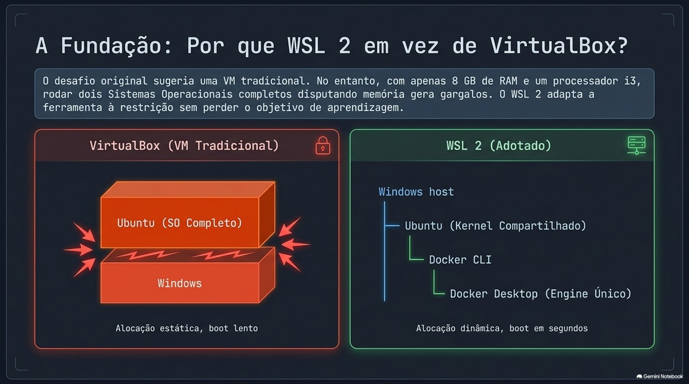

| Item | Especificação |
| --- | --- |
| Processador | Intel Core i3 · 2 núcleos |
| Memória RAM | 8 GB |
| Sistema host | Windows 11 Pro |
| Ambiente Linux | **WSL 2 · Ubuntu 24.04 LTS** |

A instrução original do curso sugere uma VM tradicional (VirtualBox). Com 8 GB de RAM e um i3 de 2 núcleos, subir um sistema operacional completo no VirtualBox significaria manter **dois SOs disputando a mesma memória**, cada um com sua própria engine de contêiner:

```text
      VirtualBox (VM tradicional)                    WSL 2 (adotado)
 ┌───────────────────────────────────┐      ┌───────────────────────────────────┐
 │ Windows                           │      │ Windows                           │
 │  └── VM Ubuntu (SO completo)      │      │  └── Ubuntu (kernel compartilhado)│
 │       └── Docker Engine próprio   │      │       └── Docker CLI              │
 │                                   │      │            └── Docker Desktop     │
 │  RAM   : dividida entre 2 SOs     │      │                 (engine único)    │
 │  Boot  : minutos                  │      │  RAM   : alocação dinâmica        │
 │  Windows: integração manual       │      │  Boot  : segundos                 │
 └───────────────────────────────────┘      │  Windows: /mnt/c nativo           │
                                            └───────────────────────────────────┘
```

O WSL 2 compartilha o kernel e faz alocação dinâmica de memória, e o Docker Desktop expõe uma **engine única** para os dois lados através da *WSL Integration*.

Resultado prático: o mesmo aprendizado e a mesma superfície de comandos Linux, por uma fração do custo de memória — **adaptar a ferramenta à restrição sem abrir mão do objetivo de aprendizagem**. Todas as referências a "sua VM" neste guia correspondem à estação **WSL 2 + Ubuntu 24.04 LTS**.

### 7.2. SSM × SSH: o comparativo completo

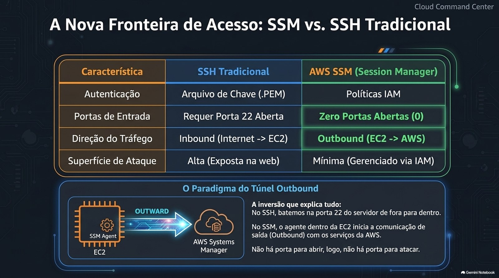

| Característica | SSH tradicional | AWS SSM (Session Manager) |
| --- | --- | --- |
| Autenticação | Arquivo de chave `.pem` | **AWS IAM** (usuários / roles) |
| Portas de entrada | Requer a **porta 22 aberta** | **Zero portas abertas** |
| Direção do tráfego | *Inbound* (entra na EC2) | *Outbound* (a EC2 chama o SSM) |
| Necessidade de IP público | Sim (ou bastion host / VPN) | Não — pode ser 100% privada |
| Gestão de chaves | Manual, com compartilhamento de arquivo | Centralizada pelo IAM |
| Auditoria e logs | Logs locais no Linux | **CloudTrail, S3 e CloudWatch** |
| Superfície de ataque | Alta (porta exposta na internet) | **Mínima** |
| Suporte a MFA / SSO | Não nativo | Nativo, via IAM |

**A inversão que explica tudo:** no SSH, *eu* bato na porta do servidor — por isso preciso abri-la. No SSM, o **agente dentro da EC2** é quem inicia a comunicação de saída com o serviço da AWS. Não há porta para abrir, e não há porta para atacar.

### 7.3. A arquitetura na AWS

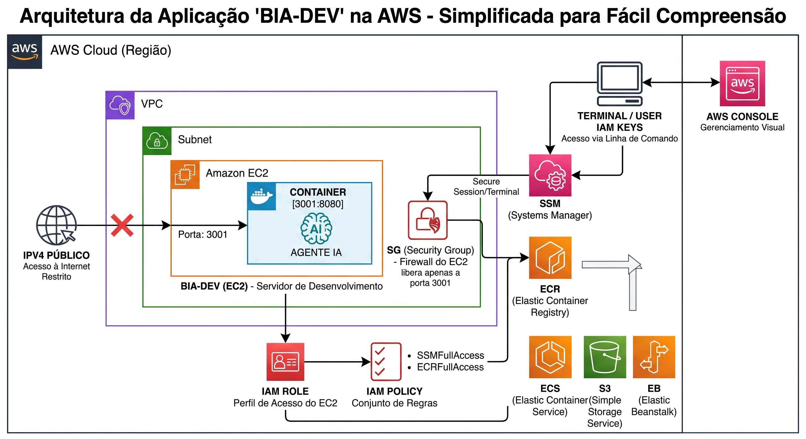

| Componente | Papel na arquitetura |
| --- | --- |
| **Terminal / IAM Keys** | A estação WSL acessando a AWS por linha de comando, autenticada pelo IAM |
| **AWS Console** | Interface web, usada apenas para conferência visual e criação inicial do usuário |
| **VPC** | Rede virtual isolada que contém todos os recursos do laboratório |
| **Subnet** | Sub-rede (zona A) onde a instância EC2 foi alocada |
| **IPv4 público** | O "X" no diagrama indica o acesso vindo da internet, bloqueado/restrito por padrão |
| **SG (Security Group)** | Firewall virtual da EC2 — libera apenas a porta **3001** |
| **BIA-DEV (EC2)** | Servidor de desenvolvimento onde a aplicação roda |
| **Container `3001:8080`** | O tráfego que chega na porta 3001 do host é redirecionado para a 8080 do contêiner |
| **IAM Role** | Identidade *vestida* pela EC2 — permite acessar serviços AWS **sem chave fixa no código** |
| **IAM Policy** | Regras anexadas à role: acesso ao **SSM** e ao **ECR** |
| **SSM** | Abre um terminal seguro na EC2 **sem depender de SSH e sem porta 22 aberta** |
| **ECR** | Registry privado de imagens Docker — destino da imagem construída no WSL |
| **ECS · S3 · EB** | Serviços do ecossistema presentes no ambiente, usados nas etapas seguintes da formação |

### 7.4. O que aprendi

1. **Comunicação e autorização são camadas distintas.** Security Group responde *"eu chego lá?"*; IAM responde *"eu posso agir?"*. Depurar na ordem errada custa horas.

2. **Usuário para pessoa, role para máquina.** Uma EC2 nunca deve guardar Access Key em disco — ela veste uma role e recebe credenciais rotacionadas pelo próprio serviço.

3. **Credencial temporária é o padrão, não o luxo.** Uma Access Key vazada dá acesso indefinido; um token de 12 horas com rotação a cada 15 minutos limita drasticamente a janela de dano.

4. **SSM elimina uma classe inteira de risco.** Ao inverter a direção da conexão — o agente da EC2 é quem chama a AWS — a porta 22 simplesmente deixa de existir como superfície de ataque, e todo acesso passa a ser auditável pelo CloudTrail.

5. **O profile é o contexto do CLI, e ele não é adivinhado.** Scripts que não passam `--profile` dependem de `AWS_PROFILE`. Esse detalhe foi a causa raiz do meu primeiro bloqueio.

6. **Permissão de *usar* não é permissão de *criar*.** Ter `AmazonSSMFullAccess` não dá o direito de criar a role que o SSM vai usar. Ler a mensagem de `AccessDenied` com atenção entrega a ação exata que falta.

7. **Onde a aplicação mora importa.** `/usr/bin` é do sistema operacional; `/home/ec2-user` é meu. Respeitar essa fronteira evita conflito de atualização e a tentação de rodar tudo como root.

8. **Restrição de recurso é um problema de arquitetura.** Trocar VirtualBox por WSL 2 não foi atalho — foi escolher a topologia que cabia no hardware disponível sem perder nenhum objetivo de aprendizagem.

---

## 8. Segurança neste repositório

Publicar um laboratório de nuvem exige o mesmo cuidado que operá-lo. O que foi feito antes deste repositório ir ao ar:

| Prática | Como foi aplicada |
| --- | --- |
| **Account ID mascarado** | Substituído por `111122223333` no texto e coberto por tarja em todos os prints |
| **ARNs e URIs sanitizados** | Todos os ARNs usam o Account ID de exemplo |
| **IP público de origem removido** | Substituído pela faixa de documentação `203.0.113.0/24` (RFC 5737) |
| **IDs de recurso genéricos** | Instâncias, VPC, Security Groups e Session IDs trocados por valores de exemplo |
| **Chaves privadas fora do Git** | `*.pem`, `*.ppk` e `*.csv` estão no `.gitignore` — uma chave `.pem` **nunca** deve ser versionada |
| **Anotações brutas fora do Git** | O arquivo de notas originais, que contém os dados reais, está no `.gitignore` |
| **Prints originais fora do Git** | Guardados localmente em `_originais_privados/`, também ignorado |
| **PDFs de apoio fora do Git** | Os PDFs usados como material de estudo exibem o Account ID e IDs de instância **reais**, sem tarja — `*.pdf` está no `.gitignore` |
| **Slides revisados um a um** | Os slides publicados em `imagens/slides/` saíram do PDF de apoio. Os **três** que exibiam Account ID, instance ID ou Session ID reais foram **deixados de fora** — nenhum slide publicado precisou de tarja |
| **Material gerado por IA sinalizado** | O infográfico da [seção 2](#2--roadmap-da-solução) tem erros de digitação nos comandos e está marcado como mapa visual, não como referência — os comandos válidos são os das Etapas 0 a 12 |

**Débitos reconhecidos, e que ficam como próximo passo:**

- **MFA não habilitado** no usuário IAM — visível como aviso no próprio print da [Etapa 2](#etapa-2--criar-o-usuário-iam-no-console). Em qualquer conta com valor real, MFA é obrigatório.
- **`"Resource": "*"`** na inline policy da [Etapa 6](#etapa-6--criar-a-role-role-acesso-ssm) — deveria ser restrito aos ARNs específicos.
- **`Anywhere-IPv4`** na porta 3001 da [Etapa 5](#etapa-5--criar-o-security-group-bia-dev) — em produção, a origem seria um Load Balancer ou uma faixa conhecida.

Documentar o que ainda não está ideal faz parte do trabalho: em segurança, o risco que se conhece é o que se pode planejar.

---

## 9. Créditos e referências

**Formação**

- **Mentoria Desafios Fundamentais — Formação AWS**, conduzida por **Henrylle Maia**
- Projeto BIA: [github.com/henrylle/bia](https://github.com/henrylle/bia)

**Documentação oficial consultada**

- [AWS CLI — Instalação (Linux)](https://docs.aws.amazon.com/cli/latest/userguide/getting-started-install.html)
- [AWS Systems Manager — Session Manager](https://docs.aws.amazon.com/systems-manager/latest/userguide/session-manager.html)
- [Session Manager Plugin — Instalação](https://docs.aws.amazon.com/systems-manager/latest/userguide/session-manager-working-with-install-plugin.html)
- [IAM — Credenciais de segurança temporárias](https://docs.aws.amazon.com/IAM/latest/UserGuide/id_credentials_temp.html)
- [Amazon ECR — Autenticação de registry privado](https://docs.aws.amazon.com/AmazonECR/latest/userguide/registry_auth.html)
- [Amazon EC2 — Security Groups](https://docs.aws.amazon.com/AWSEC2/latest/UserGuide/ec2-security-groups.html)
- [WSL — Documentação Microsoft](https://learn.microsoft.com/pt-br/windows/wsl/)
- [Docker Desktop — WSL 2 backend](https://docs.docker.com/desktop/wsl/)

---

<div align="center">

**Rafael Silva** · [GitHub](https://github.com/RafaelSilva89)

*Desafio 2 — Formação AWS · Desafios Fundamentais*

</div>
